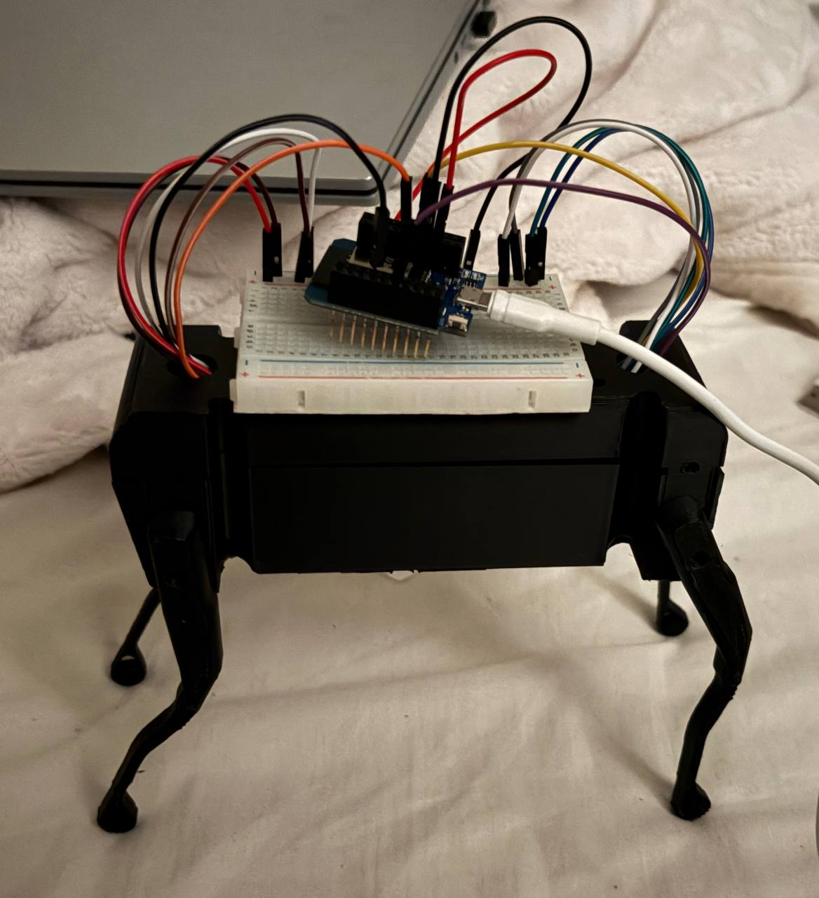
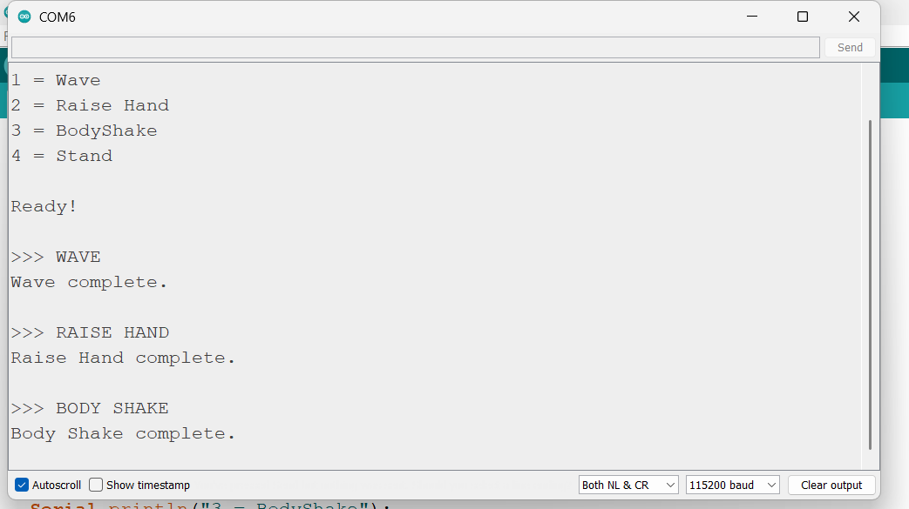

# Robot Dog - Servo Motion Control

## Overview
This project demonstrates the control of a four-legged robot dog using an ESP32 and four servo motors. Each servo motor is connected to one leg of the robot and was individually calibrated to determine its neutral position.

The project includes three programmed robot motions:
- Wave
- Raise Hand
- Sit & Down
The motions are controlled through the Arduino Serial Monitor.

---
## Project Images
### Robot Dog

  

### Serial Monitor

  

---

## Demonstration Video
[Watch Demonstration Video](Vid.MOV)

---

## Features
- Four servo motors controlling the robot's legs.
- Individual servo calibration.
- Saved neutral positions for each leg.
- Serial Monitor control.
- Three programmed robot motions.
- Smooth servo movement.

---

## Hardware Components
- ESP32
- 4 Servo Motors
- Breadboard
- Jumper Wires
- USB Cable

---

## Pin Connections
| Component | ESP32 Pin |
|---|---|
| Front Left Servo Signal | GPIO17 |
| Front Right Servo Signal | GPIO18 |
| Rear Left Servo Signal | GPIO4 |
| Rear Right Servo Signal | GPIO23 |
| Servo VCC | VCC |
| Servo GND | GND |

---

## Servo Calibration
The servo motors were calibrated individually because the physical orientation of each servo is different.
| Leg | Neutral Angle |
|---|---:|
| Front Left (FL) | 180° |
| Front Right (FR) | 36° |
| Rear Left (RL) | 78° |
| Rear Right (RR) | 176° |

These values are used as the robot's default standing position.

---

## Robot Motions

### Wave
The rear-left leg (RL) is used to perform the waving motion.
Command: `1`

### Raise Hand
The front-left leg (FL) is raised and then returned to its neutral position
Command: `2`

### Sit & Down
The third programmed motion is named Sit & Down.
Command: `3`

---

## How It Works
1. Connect the ESP32 to the computer using USB.
2. Upload `Task_2_Mec.ino` using Arduino IDE.
3. Open the Serial Monitor.
4. Set the baud rate to `115200`.
5. Enter the required command.
6. The ESP32 sends the corresponding PWM signal to the servo motors.
7. The selected motion is performed by the robot.

---

## Serial Monitor Commands
| Command | Motion |
|---|---|
| `1` | Wave |
| `2` | Raise Hand |
| `3` | Sit & Down |

---

## Technologies Used
- Arduino IDE
- ESP32
- C++
- LEDC PWM
- Servo Motors
- Serial Monitor

---

## Repository Files
| File | Description |
|---|---|
| `Task_2_Mec.ino` | Main Arduino code |
| `Ard.jpg` | Robot dog image |
| `Screenshot.png` | Project screenshot |
| `Vid.MOV` | Demonstration video |
| `README.md` | Project documentation |
